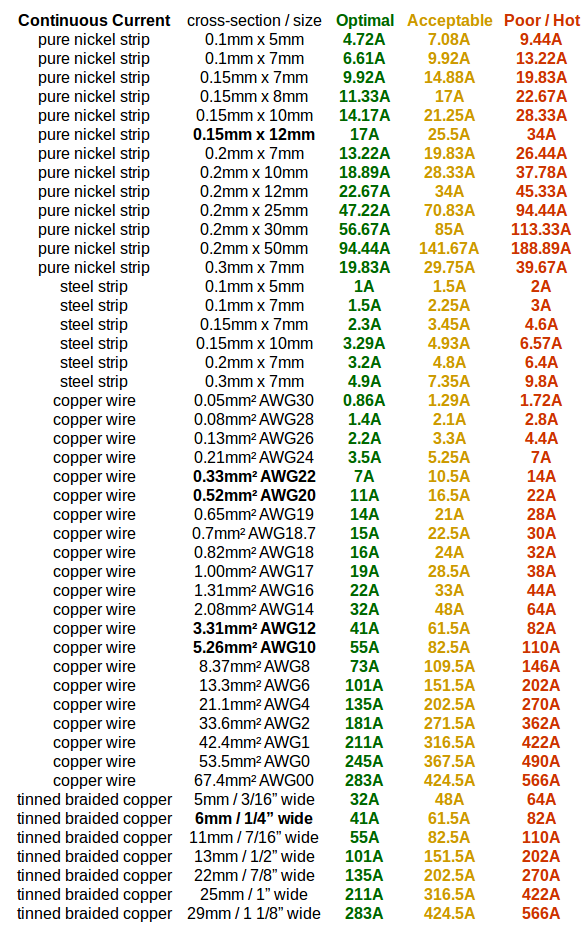
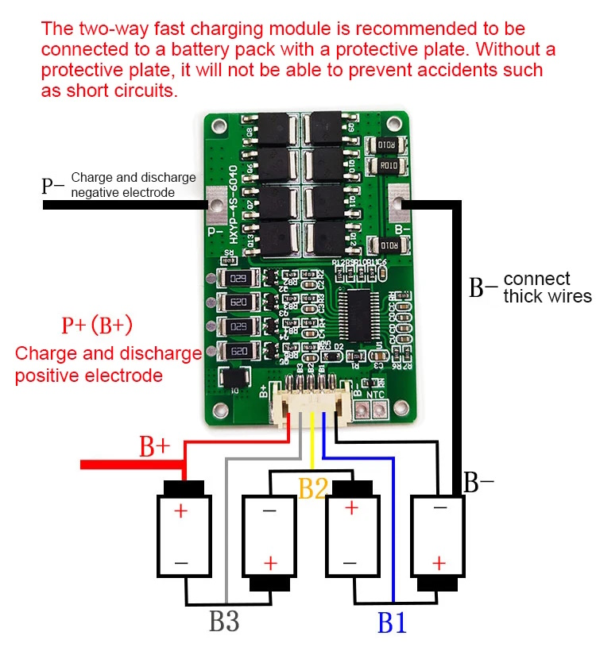
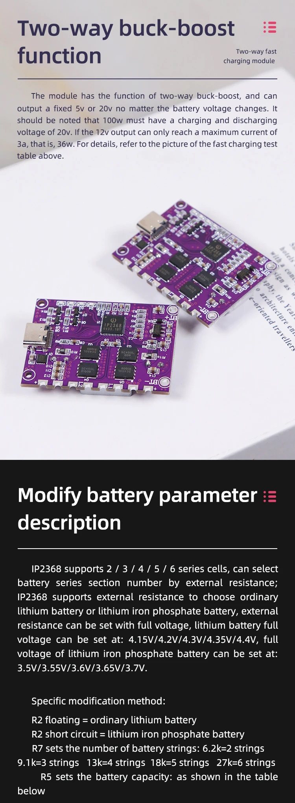
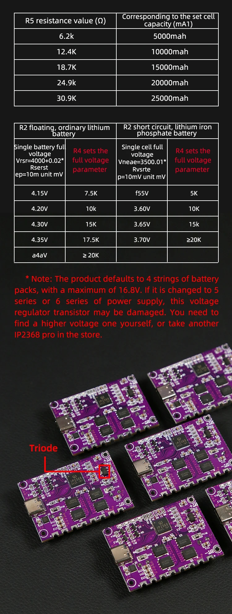

# BatteryPacks

This is the repository for my battery pack for power tools [video]() based on GreatScott's battery pack [video](https://www.youtube.com/watch?app=desktop&v=_WI9Nwqvplo).

## Documentation:

For the IP2368 documents, I have two: First I got a translated one (V1.2) from one comment of GreatScott's video'. The second one (V1.35) I got from what I think is a more official source.
You can also find here the Li-Ion battery's datasheet (INR18650).

## Images:

This was my reference for metal strips for battery packs:

The balancing board should be connected like this:

The aliexpress vendor had some curious brochures to describe the IP2368:

